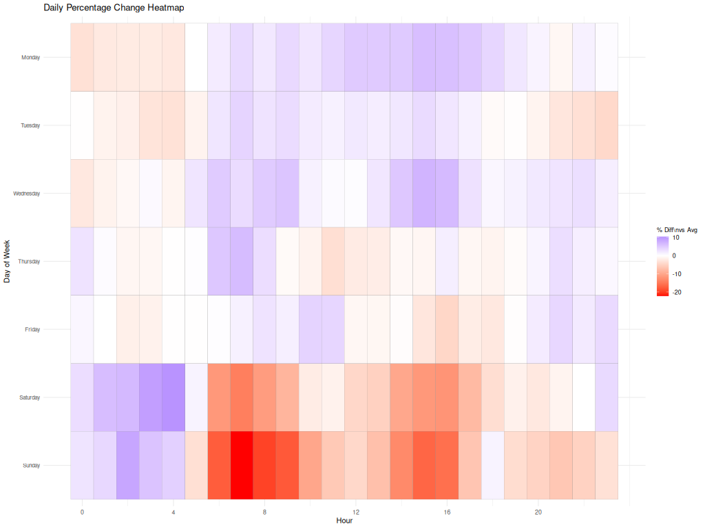
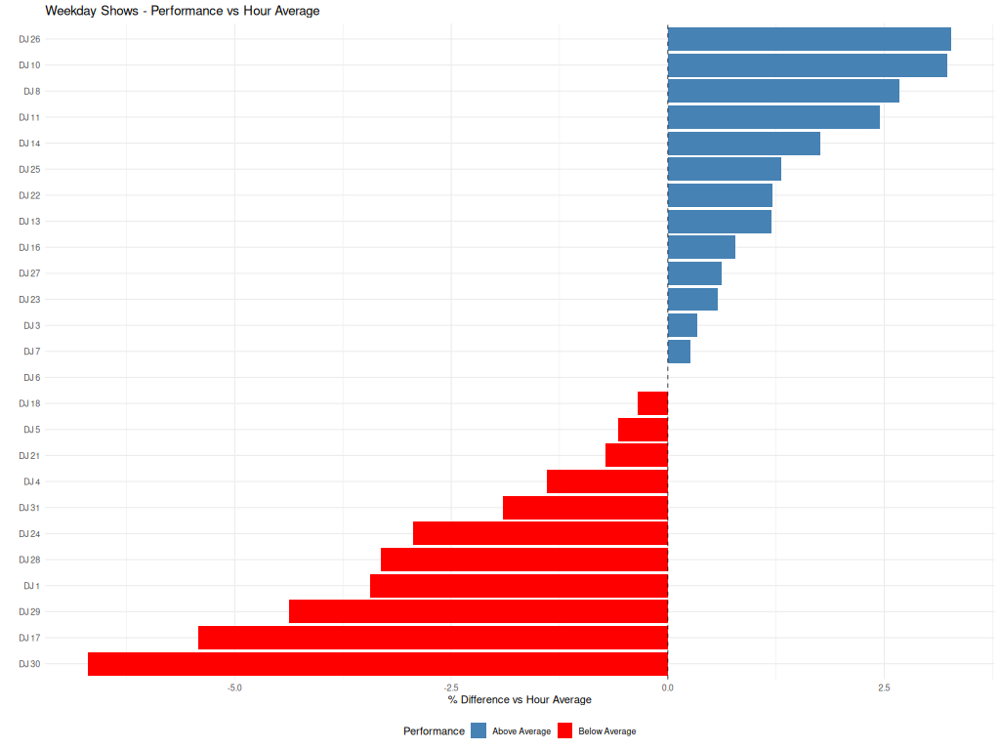
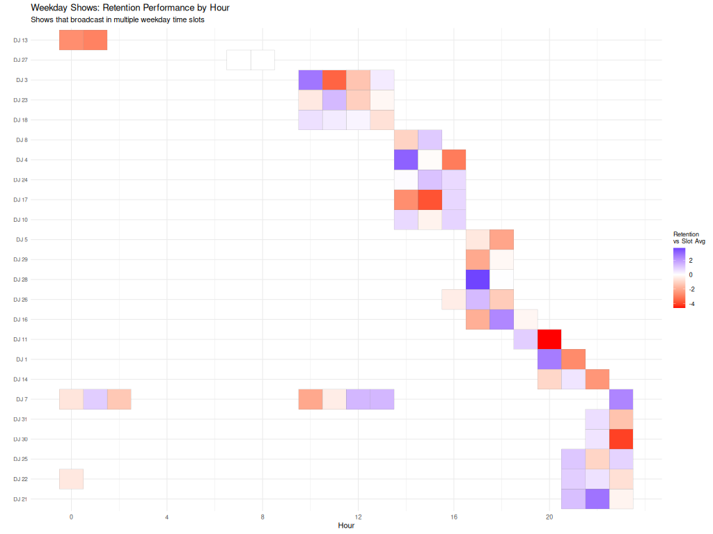
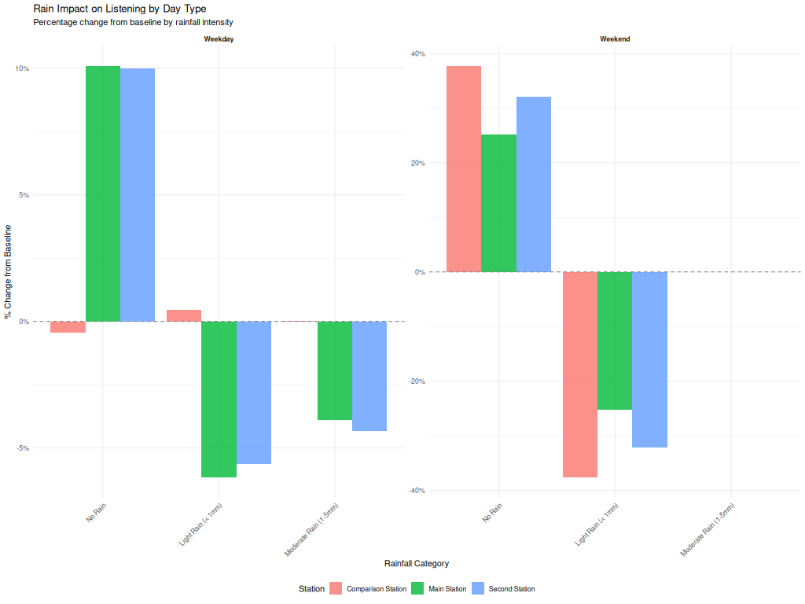
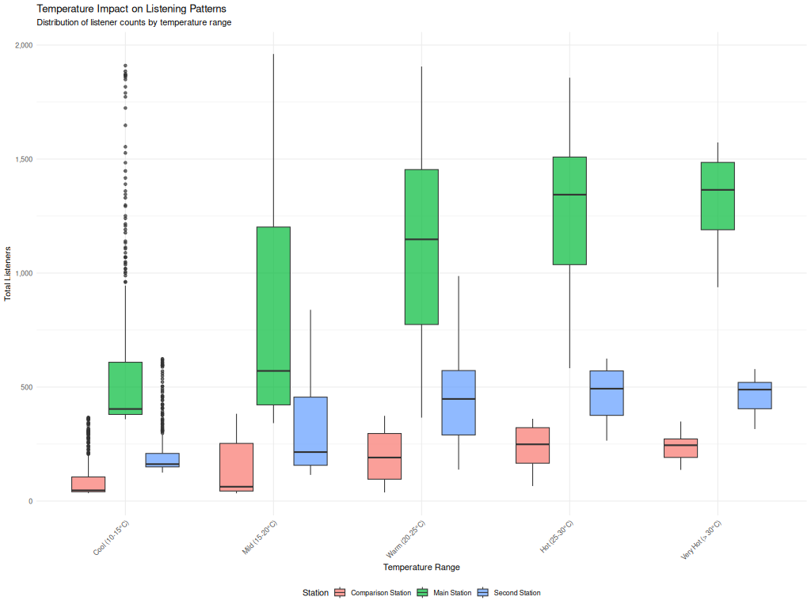

# RadioIntel AI v4.0 🎙️🤖
## Intelligent Radio Programming with Advanced Analytics

*Real-time listener analytics driving AI-powered radio automation*

---

## 🚀 **What is RadioIntel AI?**

RadioIntel AI is the **first open-source AI radio automation system** that combines comprehensive listener analytics with intelligent programming decisions. Born from academic research into radio audience behavior, it has evolved into a complete AI DJ system capable of autonomous radio programming with broadcast-precision timing.

### **The Complete Intelligence Pipeline**
```
Real-time Analytics → AI Programming → Precision Playout
        ↓                    ↓              ↓
   Statistical Engine    Context-Aware     M3U Output
   (50+ Metrics)        Decision Making   (Broadcast Ready)
```

---

## ✨ **Core System Features**

### 📊 **Advanced Statistical Analytics Foundation**
*The real innovation - where basic streaming data becomes actionable intelligence*

- **Real-time Monitoring**: Automated data collection from streaming servers every 5 minutes
- **Comprehensive Statistical Analysis**: 50+ metrics with confidence intervals and significance testing
- **Multi-dimensional Correlation**: Weather impact, temporal patterns, genre effectiveness, presenter performance
- **Predictive Modeling**: Trend forecasting, seasonal decomposition, and audience behavior prediction
- **Professional Reporting**: Executive dashboards and detailed PDF reports with LaTeX formatting
- **Cross-station Benchmarking**: Competitive intelligence and market positioning analysis

### 🧠 **AI Programming Intelligence**
*Powered by the statistical foundation above*

- **Context-Aware Music Selection**: Considers listener patterns, weather, time-of-day, and historical performance
- **Real-time Adaptation**: Continuously learns from audience behavior and adjusts programming decisions
- **Intelligent Track Relationships**: Maps musical connections and flow between artists for seamless programming
- **Multiple AI Modes**: DJ Assistant, Perpetual Mode, and Precision Timing Mode for different use cases

### 🎯 **Precision Programming Features**
- **Surgical Timing Control**: Sub-minute accuracy for commercial breaks and news slots
- **Dynamic Genre Balancing**: AI maintains optimal music variety while responding to audience preferences
- **Artist Relationship Mapping**: Intelligent sequencing based on musical connections and audience flow
- **Professional M3U Output**: Broadcast-ready playlists with timing metadata
- **Easily Extensible**: Easily integrate with your existing playout system. Some example integrations are provided.

---

## 📊 **Comprehensive Statistical Analysis Gallery**

*RadioIntel AI's sophisticated analytics engine in action*

### **Daily Performance & Temporal Analysis**
  

*Advanced temporal analysis revealing hour-by-hour and day-by-day performance patterns. Identifies optimal programming windows and audience behavior cycles.*

### **Genre Impact & Music Intelligence**

*Sophisticated statistical analysis quantifying which musical genres attract or repel listeners, for evidence-based music policy development.*

### **Presenter Performance Analytics**



*Comprehensive statistical comparisons of presenter performance, genre diversity analysis, and deviation from station norms. Enables objective evaluation of on-air talent.*

### **Cross-Station Competitive Intelligence**


*Multi-dimensional comparative analysis providing competitive intelligence and market positioning insights with statistical benchmarking.*

### **Audience Engagement & Retention Modeling**


*Statistical modeling of audience behavior patterns, retention analysis, and engagement prediction with trend forecasting and confidence intervals.*

### **Weather Correlation & Environmental Impact**


*Correlation analysis between environmental factors (temperature, weather conditions, daylight) and listening patterns, enabling context-aware programming decisions.*

---

## 📈 **Advanced Statistical Capabilities**

### **Real-Time Analytics Engine**
- **Automated Data Collection**: Monitor Shoutcast/Icecast streams every 5 minutes with comprehensive error handling
- **Multi-Stream Support**: Aggregate data from multiple bitrates and formats (AAC, MP3)
- **Data Quality Assurance**: Robust validation and anomaly detection with automatic correction
- **API Integration**: Weather data, music metadata, and show scheduling with fallback hierarchies

### **Statistical Analysis Methods**
- **Confidence Intervals**: 95% confidence bounds on all major performance metrics
- **Significance Testing**: P-values and Z-scores for programming decision validation
- **Trend Analysis**: Month-over-month comparisons with growth rate calculations and forecasting
- **Seasonal Decomposition**: Identification of recurring patterns, anomalies, and cyclical behavior
- **Correlation Analysis**: Multi-dimensional relationships between music, weather, and audience behavior
- **Retention Modeling**: Statistical analysis of audience flow and engagement patterns

### **Advanced Analytical Methods**
- **Time Series Analysis**: Sophisticated temporal pattern recognition and forecasting
- **Multi-variate Analysis**: Complex relationships between programming and audience response
- **Comparative Statistics**: Cross-station benchmarking with statistical significance testing
- **Performance Metrics**: Hour-by-hour analysis with time slot averages and statistical significance
- **Genre Classification**: Intelligent fallback hierarchy using MusicBrainz, Last.fm, and Wikipedia APIs
- **Presenter Analysis**: Individual DJ performance metrics and music diversity scoring

---

## 🎭 **AI Operation Modes**

### **1. DJ Assistant Mode** (`suggestions()`)
Perfect for live DJs wanting AI-powered track recommendations:
- Provides intelligent next-track suggestions based on current context
- Considers recent programming, audience trends, and optimal flow
- Displays confidence scores and reasoning for each recommendation
- Updates recommendations based on real-time listener response

### **2. Perpetual Mode** (`ai_dj()`)
Autonomous AI DJ for continuous programming:
- Generates endless intelligent music sequences
- Adapts programming based on time-of-day and audience patterns
- Maintains genre diversity while optimizing listener engagement
- Perfect for automated overnight or unattended broadcast periods

### **3. Precision Timing Mode** (`ai_dj_timed()`)
Professional broadcast automation with exact timing control:
- Generates precisely-timed programming blocks (default: 29 minutes)
- Hits exact time marks for commercial breaks and news slots
- Includes AI-generated track introductions with text-to-speech
- Outputs broadcast-ready M3U playlists with timing metadata

---

## 📈 **Example System Outputs**

### **AI DJ Assistant Mode**
```
🎧 AI RECOMMENDATIONS for Your Radio Station
=====================================
Current Context: Growing audience (+8%), Prime time, Sunny weather

1. 🎵 Fleetwood Mac - Go Your Own Way (Confidence: 94%)
   💡 Perfect for current upward trend, matches recent rock momentum
   
2. 🎵 Eagles - Hotel California (Confidence: 89%)  
   💡 Classic track, excellent retention, fits current energy level
   
3. 🎵 Queen - Don't Stop Me Now (Confidence: 86%)
   💡 High-energy track perfect for growing audience
```

### **Real-time Context Analysis**
```
📊 CURRENT CONTEXT ANALYSIS
============================
👥 Current Listeners: 1,247 (↑ 8% vs hour average)
📈 Trend Direction: Growing (+15 listeners/hour)
🎯 Engagement Level: High (95% retention rate)
🎲 Risk Tolerance: Medium (stable audience, can experiment)
🎤 Presenter Context: Above average performance (+12% vs slot)
🌤️ Weather Context: Sunny, 22°C (positive listening correlation)
💾 Data Source: Fresh SQL (2 minutes old)
```

### **Precision Timing Mode Output**
```
📊 PRECISION TIMING BLOCK GENERATED
=====================================
Target Duration: 29:00 (1740 seconds)
Actual Duration: 28:58 (1738 seconds)
Timing Gap: -2 seconds ✅

Generated Files:
📁 Your_Station_AI_Playlist_2025_07_30.m3u
🎙️ 3 AI-generated introductions with TTS audio files
```

---

## 🏆 **What Makes RadioIntel AI Unique**

### **Comprehensive Feature Comparison**

| Feature | Commercial Radio Systems | Other Open Source | RadioIntel AI v4.0 |
|---------|--------------------------|-------------------|---------------------|
| **AI-Driven Programming** | ❌ | ❌ | ✅ |
| **Real-time Analytics** | Limited | ❌ | ✅ (50+ metrics) |
| **Statistical Significance Testing** | ❌ | ❌ | ✅ |
| **Weather Correlation Analysis** | ❌ | ❌ | ✅ |
| **Multi-dimensional Analysis** | ❌ | ❌ | ✅ |
| **Predictive Modeling** | ❌ | ❌ | ✅ |
| **Context-Aware Decisions** | ❌ | ❌ | ✅ |
| **Sub-minute Timing Precision** | ✅ | ❌ | ✅ |
| **Professional PDF Reports** | Limited | ❌ | ✅ |
| **Cross-station Benchmarking** | ❌ | ❌ | ✅ |
| **Easily Extensible** | ❌ | ✅ | ✅ |
| **Open Source** | ❌ | ✅ | ✅ |
| **Academic Research Foundation** | ❌ | ❌ | ✅ |
| **Cost** | $10,000-50,000+ | Free | Free |

### **Statistical Analysis Capabilities**

| Analysis Type | Basic Analytics | RadioIntel AI |
|---------------|-----------------|---------------|
| **Real-time Processing** | ❌ | ✅ (5-minute intervals) |
| **Confidence Intervals** | ❌ | ✅ (95% bounds) |
| **Significance Testing** | ❌ | ✅ (Z-scores) |
| **Trend Analysis** | ❌ | ✅ (Seasonal decomposition) |
| **Correlation Analysis** | ❌ | ✅ (Multi-variate) |
| **Retention Modeling** | ❌ | ✅ (Predictive) |
| **Performance Forecasting** | ❌ | ✅ (Time series) |
| **Comparative Benchmarking** | ❌ | ✅ (Cross-station) |

---

## 🛠 **Technical Architecture**

### **Core Components**
1. **Data Collection Layer** (`radio_analytics_scraper.php`)
   - Automated monitoring of Shoutcast/Icecast streams
   - API integration for weather, genre classification, and show scheduling
   - Real-time database updates with comprehensive error handling

2. **AI Programming Engine** (`radio_intel.R`)
   - Statistical analysis engine with machine learning models
   - Context-aware decision algorithms and playlist optimization
   - Dynamic intro generation with LLM integration (Claude/ChatGPT)
   - Professional M3U playlist generation with timing metadata

3. **Supporting Data** (SQL files)
   - `artist_equivalencies.sql` - Musical relationship mapping
   - `dj_talking_points.sql` - Context database for AI introductions

### **AI Decision Framework**
The AI considers multiple data streams simultaneously:
- **Listener Engagement**: Real-time audience numbers and retention patterns
- **Historical Performance**: Track, artist, and genre success rates
- **Environmental Context**: Weather, time-of-day, seasonal patterns
- **Musical Intelligence**: Artist relationships and genre compatibility
- **Broadcast Constraints**: Timing requirements and programming flow

---

## 🎯 **Use Cases & Applications**

### 🏢 **Commercial Radio Stations**
- **Replace expensive automation systems** with intelligent AI programming
- **Data-driven music policies** based on actual listener behavior, not guesswork
- **Competitive intelligence** through multi-station analysis and benchmarking
- **Cost reduction** while improving programming quality and listener retention

### 📻 **Internet & Community Radio**
- **Professional-grade automation** previously available only to major market stations
- **Intelligent music discovery** helping smaller stations compete with larger operations
- **Volunteer DJ assistance** with AI-powered track suggestions and timing help
- **24/7 automation** with personality and context-awareness

### 🎓 **Academic & Research**
- **Broadcasting Research**: Study the effectiveness of AI vs human programming decisions
- **Music Information Retrieval**: Large-scale analysis of listener preferences and music relationships
- **Machine Learning Applications**: Real-world AI system with immediate measurable outcomes
- **Media Studies**: Quantitative analysis of radio consumption patterns and behavior

### 💼 **Industry Professionals**
- **Radio Consultants**: Data-driven programming recommendations with AI insights
- **Music Directors**: AI assistance for playlist creation and music policy development
- **Broadcasting Engineers**: Precision timing systems with professional-grade accuracy
- **Equipment Manufacturers**: Reference implementation for AI integration in broadcast systems

---

## 📋 **Requirements & Installation**

### **System Requirements**
- **PHP 7.4+** with cURL and JSON support for data collection
- **R 4.0+** with package installation capability for AI engine
- **MariaDB/MySQL 5.7+** for data storage and analysis
- **LaTeX distribution** (optional, for PDF reporting)

### **Required R Packages**
Automatically installed on first run:
- **Database**: `DBI`, `RMariaDB`
- **Data Processing**: `dplyr`, `lubridate`, `tidyr`, `stringr`
- **Machine Learning**: `randomForest`, `xgboost`, `forecast`
- **Visualization**: `ggplot2`, `scales`, `corrplot`

### **API Keys (Optional but Recommended)**
- **Claude API** or **ChatGPT API** for advanced intro generation
- **Google TTS** or **Amazon Polly** for speech synthesis
- **Last.fm API** for enhanced music metadata
- **OpenWeatherMap API** for weather correlation analysis

---

## 🚀 **Quick Start Guide**

### **1. Database Setup**
```sql
-- Create database and user
CREATE DATABASE radio_intel;
CREATE USER 'radio_user'@'localhost' IDENTIFIED BY 'your_password';
GRANT ALL PRIVILEGES ON radio_intel.* TO 'radio_user'@'localhost';
FLUSH PRIVILEGES;
```

### **2. Configure Data Collection**
Edit `radio_analytics_scraper.php`:
```php
// Database Configuration
$server = 'localhost';
$user = 'radio_user';
$pass = 'your_password';
$db = 'radio_intel';

// Stream URLs (adapt for your setup)
$main_stream_urls = [
    'http://your-server.com:8000/status-json.xsl'
];
```

### **3. Set Up Automated Collection**
```bash
# Add to crontab for 5-minute collection intervals
crontab -e

# Add this line:
*/5 * * * * /usr/bin/php /path/to/radio_analytics_scraper.php
```

### **4. Configure AI Engine**
Edit the configuration section in `radio_intel.R`:
```r
# Database Configuration
DB_HOST <- "localhost"
DB_USER <- "radio_user"
DB_PASSWORD <- "your_password"
DB_NAME <- "radio_intel"

# Station Configuration
MAIN_STATION_NAME <- "Your Radio Station"
NETWORK_MUSIC_PATH <- "/path/to/your/music/library"

# AI Configuration (optional)
USE_FOR_INTROS <- "claude"  # or "chatgpt"
CLAUDE_ANTHROPIC_API_KEY <- "your-claude-key"
TTS_SERVICE <- "google"  # for voice synthesis
```

### **5. Initialize and Run**
```r
# Start R and load the system
source("radio_intel.R")

# Initialize (first time only)
validate_config()

# Run AI DJ modes
suggestions()      # Get AI recommendations
ai_dj()           # Autonomous programming  
ai_dj_timed()     # Precision timing mode
```

---

## 💡 **Core Functions Reference**

### **Analytics Functions**
- `generate_report()` - Generate comprehensive statistical analysis
- `context_full()` - Detailed current context analysis
- `context_short()` - Quick context summary
- `update_stats()` - Refresh statistical models

### **AI Programming Functions**
- `suggestions(n=5)` - Get AI track recommendations for DJs
- `ai_dj()` - Run autonomous AI DJ (perpetual mode)
- `ai_dj_timed(minutes=29)` - Precision timing mode for broadcast

### **Utility Functions**
- `are_linked("artist1", "artist2")` - Check musical relationships
- `check_intro("artist", "song")` - Verify intro availability
- `help()` - Display function menu and usage guide

---

## 🔧 **Advanced Configuration**

### **Timing Precision Settings**
```r
TIME_MARK_BLOCK_LENGTH <- 29  # Minutes for precision timing
CROSS_FADE_IN <- 3           # Seconds of crossfade
CROSS_FADE_OUT <- 3          # Seconds of crossfade
ESTIMATED_DURATION_OF_INTROS <- 30  # AI intro duration
```

### **AI Behavior Tuning**
```r
# AI personality and decision-making
AI_RUNTIME_MODE <- "timing"   # timing, perpetual, or assistant
TOTAL_PLAYS_FILTER <- 2      # Minimum plays for track consideration
RECENT_PLAY_EXCLUSION_HOURS <- 6  # Avoid recent repeats
```

### **Professional Integration**
```r
PLAYOUT_TARGET <- "M3U"      # Output format
# Future: Professional playout system integration available
```

---

## 🔍 **Data Privacy & Compliance**

### **Privacy-First Design**
- **No Personal Data Collection**: Only aggregate listener counts are stored without individual identification
- **IP Anonymization**: Unique listeners counted by IP address without storing personal information
- **GDPR Compliant**: No personally identifiable information collected, processed, or retained
- **Configurable Retention**: Set custom data retention periods in database configuration

### **Data Security**
- **Secure Database Connections**: Modern SQL practices with prepared statements and injection prevention
- **API Key Protection**: Configuration-based key management with optional encryption support
- **Access Control**: Database user permissions limiting access to analytics data only
- **Audit Trail**: Comprehensive logging of all data collection and analysis activities

---

## 🎓 **Academic Use & Citation**

### **Research Applications**
RadioIntel AI provides a unique **research platform** for:

- **AI & Machine Learning Research**: Real-world recommendation system with measurable outcomes
- **Broadcasting & Media Studies**: Quantitative analysis of radio programming effectiveness  
- **Music Information Retrieval**: Large-scale dataset generation and preference modeling
- **Statistical Methods**: Advanced time series analysis and multi-dimensional correlation studies

### **Citation Information**
If you use RadioIntel AI in academic research, please cite:

```bibtex
@software{radiointel_ai_2025,
  title = {RadioIntel AI: Intelligent Radio Programming with Advanced Analytics},
  author = {Bond, Rachael L.},
  year = {2025},
  version = {4.0},
  url = {https://github.com/rachaelbond/RadioIntel-AI},
  note = {Open-source AI radio automation system with statistical analytics foundation}
}
```

### **Research Outputs**
This system enables research publications in:
- **"Context-Aware AI for Autonomous Radio Programming"**
- **"Real-time Analytics-Driven Music Recommendation at Broadcast Scale"**  
- **"Statistical Methods for Radio Audience Behavior Prediction"**
- **"Multi-modal AI Integration in Professional Broadcasting Systems"**

---

## 🤝 **Contributing & Community**

RadioIntel AI welcomes contributions from:
- **Radio Professionals**: Real-world feedback and feature requests
- **Researchers**: Academic improvements and analysis methods  
- **Developers**: Code optimization and integration enhancements
- **Broadcasters**: Use cases and deployment experiences

### **Development Priorities**
1. Additional professional playout system integrations
2. Enhanced machine learning models for prediction accuracy
3. Real-time streaming integration improvements
4. Mobile applications for remote monitoring and control

---

## 📝 **License & Support**

**GNU General Public License v3.0** - Free for commercial use

### **Professional Services**
- Custom implementation and integration consulting
- Professional training and deployment support  
- Specialized analytics and reporting development
- Contact: radioanalytics.mjfiz@rlb.me

---

## 🎉 **Get Started Today**

RadioIntel AI represents the future of intelligent radio programming - combining academic rigor with practical broadcasting needs.

**Ready to revolutionize your radio programming?**

```bash
# Download and start your AI radio journey
git clone https://github.com/rachaelbond/RadioIntel-AI.git
cd RadioIntel-AI
# Follow Quick Start Guide above
```

---

**🎙️ From basic listener counts to intelligent radio automation - welcome to the future of broadcasting.**

*Built for radio professionals who believe in data-driven programming decisions and the power of artificial intelligence to enhance, not replace, human creativity in radio.*
