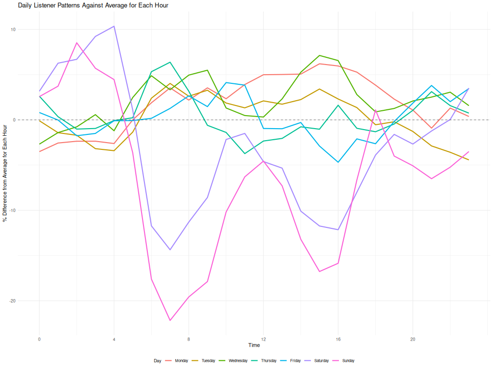
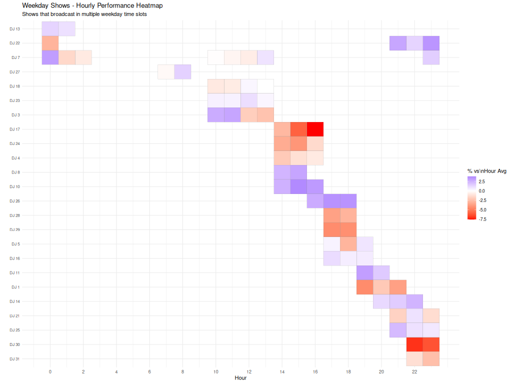
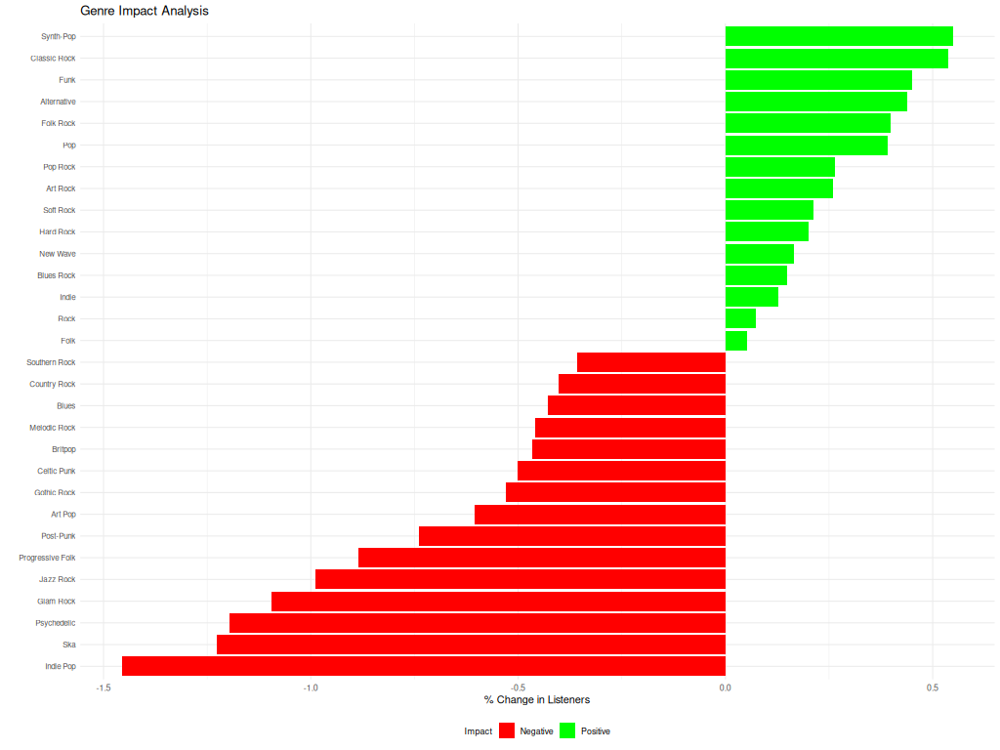
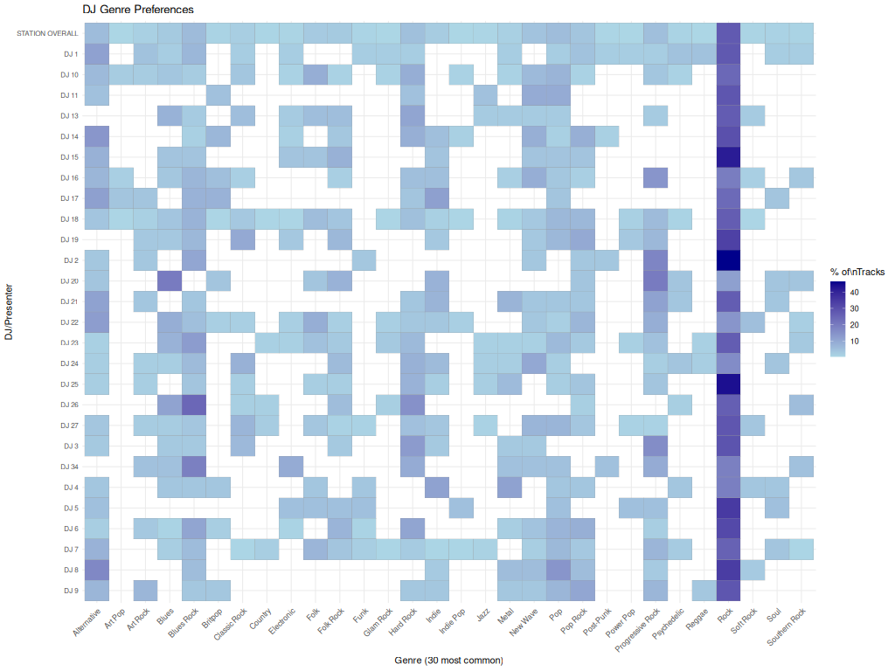
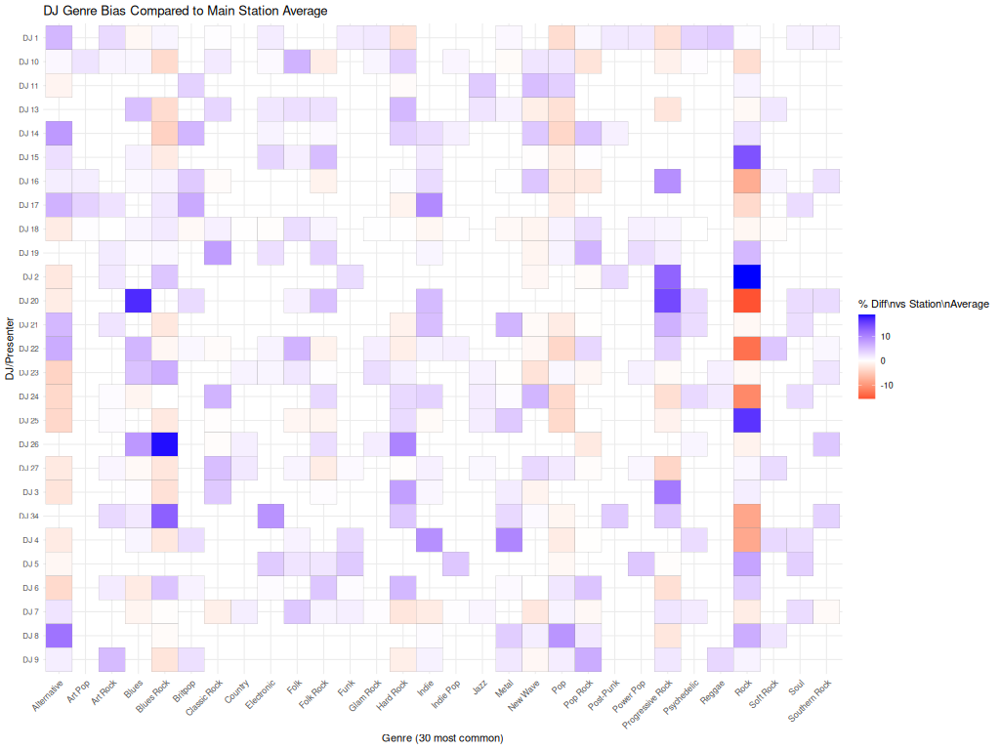
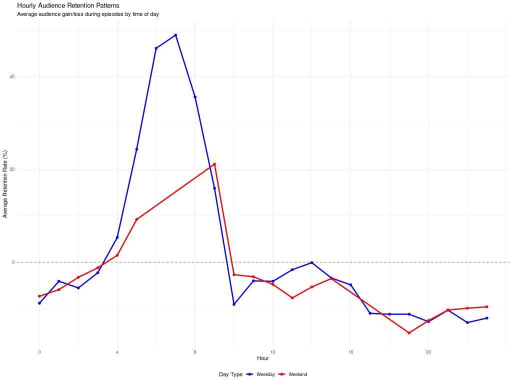
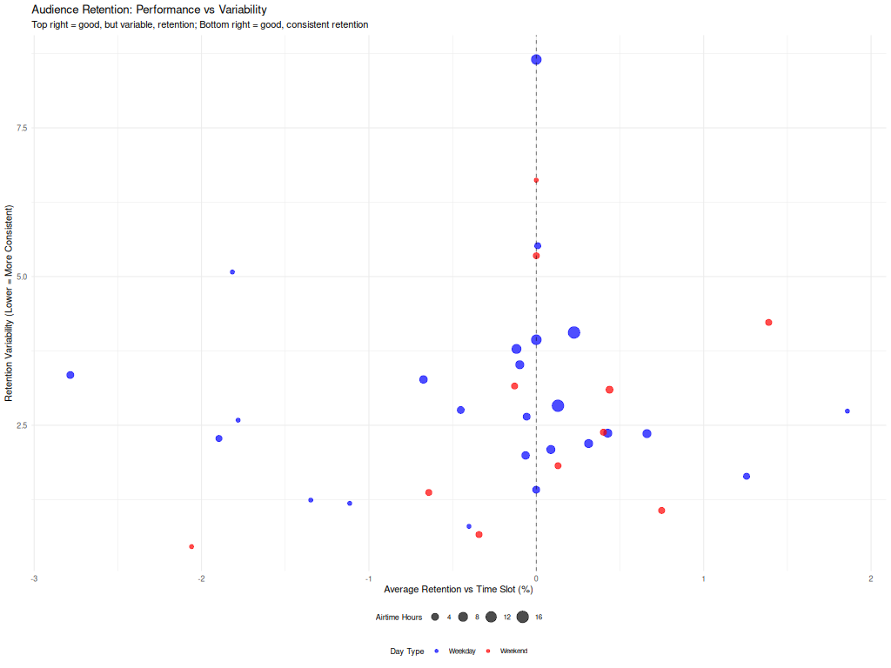
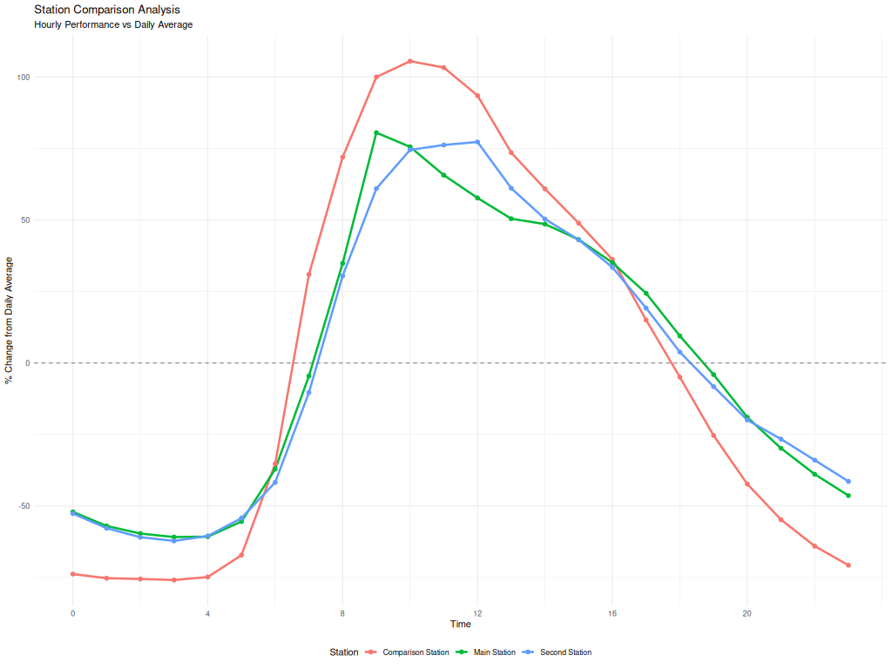
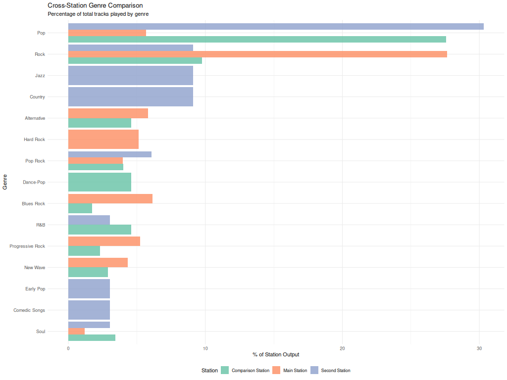

# Radio Station Listener Analysis System v3.7

A comprehensive real-time analytics platform for online radio stations, providing detailed insights into listener behavior, music preferences, and show performance through automated data collection and sophisticated statistical analysis.

## 🎯 Overview

This system automatically monitors online radio streams every 5 minutes, collecting listener counts, track information, and show metadata. It enriches this data with weather information and musical genre classification from multiple APIs, then generates detailed PDF reports with over 50 different analyses and visualizations.

The system consists of two main components:
- **PHP Data Collector** (`radio_analytics_scraper.php`) - Automated data collection from streaming servers
- **R Analytics Engine** (`radio_analytics.R`) - Advanced statistical analysis and PDF report generation

## 🆕 What's New in v3.7

- **Enhanced Memory Management**: Improved garbage collection and memory limits for large datasets
- **Multi-Station Analysis**: Support for main, second, and comparison stations simultaneously  
- **Flexible Date Ranges**: Custom date ranges or specific month analysis with contextual trends
- **Advanced Statistical Analysis**: Confidence intervals, trend analysis, and significance testing
- **Professional PDF Reports**: Over 50 charts and tables with LaTeX formatting
- **Debug Console Output**: Detailed logging for troubleshooting and monitoring
- **Robust Data Quality Checks**: Automated detection and handling of incomplete data coverage
- **Enhanced Genre Classification**: Improved fallback hierarchy with Wikipedia integration

## 📊 Key Features

### Real-Time Data Collection
- **Automated monitoring** of Shoutcast/Icecast streams every 5 minutes
- **Multi-stream support** (AAC, MP3, multiple bitrates per station)
- **Weather correlation** using OpenWeatherMap API
- **Show scheduling integration** via JSON endpoints  
- **Public holiday detection** and sunrise/sunset tracking
- **Robust error handling** and retry mechanisms with comprehensive logging

### Music Intelligence
- **Automatic genre classification** using MusicBrainz, Last.fm, and Wikipedia APIs
- **Track-level categorization** (not just artist-level)
- **Duplicate detection** and data validation
- **Genre bias analysis** for individual presenters
- **Music diversity scoring** and similarity analysis

### Advanced Analytics
- **Listener impact analysis** - which tracks/artists/genres attract or lose listeners
- **Show performance metrics** with statistical significance testing
- **DJ similarity scoring** compared to station averages
- **Temporal pattern analysis** (hourly, daily, seasonal trends)
- **Retention rate calculations** and audience flow analysis
- **Weather correlation studies** and environmental factor analysis
- **Live vs pre-recorded performance comparisons**

### Comprehensive Reporting
- **50+ visualizations** including heatmaps, scatter plots, and trend analysis
- **Executive summary tables** for quick decision-making
- **Genre performance breakdowns** with confidence intervals
- **Comparative analysis** between different time periods and stations
- **Professional PDF output** with LaTeX formatting and table of contents
- **Automatic file naming** with date ranges and station identification

## 🛠 Technical Architecture

### Data Collection Layer (PHP)
```
Shoutcast/Icecast APIs → Stream Monitoring → MariaDB/MySQL
            ↓
Weather APIs → Genre APIs → Show Schedule APIs → Astronomical Data
```

### Analysis Layer (R)
```
Database → Statistical Processing → Visualization Engine → PDF Report
    ↓              ↓                       ↓
Time Series → Genre Impact → Performance Heatmaps → Executive Summary
```

### Database Schema
The system automatically creates a comprehensive analytics table with:
- **Stream Data**: main_stream1, main_stream2, second_stream1, second_stream2, comparison_stream
- **Show Information**: showname, presenter, stand_in, recorded status for each station  
- **Music Metadata**: artist, song, genre for each station with API source tracking
- **Environmental Data**: weather_temp, weather_condition, weather_rain, public_holiday
- **Astronomical Data**: sunrise_time, sunset_time for daylight correlation analysis

## 📋 Requirements

### PHP Data Collector
- **PHP 7.4+** with cURL and JSON support
- **MariaDB/MySQL 5.7+** with CREATE and INDEX privileges
- **API Access** (optional but recommended):
  - Last.fm API key (free) for enhanced genre classification
  - OpenWeatherMap API key (free) for weather correlation
- **Cron/Systemd** capability for automated execution
- **Network Access** to streaming servers and external APIs

### R Analysis Engine  
- **R 4.0+** with package installation capability
- **Required R Packages**: 
  - Database: `DBI`, `RMariaDB`
  - Data Processing: `dplyr`, `lubridate`, `tidyr`, `stringr`
  - Visualization: `ggplot2`, `scales`, `gridExtra`, `corrplot`
  - Reporting: `knitr`, `rmarkdown`, `kableExtra`
  - Statistical: `forecast`, `glue`
- **LaTeX Distribution** (TeX Live, MiKTeX, or MacTeX) for PDF generation
- **Memory**: Minimum 4GB RAM recommended for large datasets

## 🚀 Quick Start Guide

### 1. Database Setup
```sql
-- Database and table creation is automatic
-- Just ensure your MySQL/MariaDB user has CREATE and INDEX privileges
-- Example user creation:
CREATE USER 'analytics'@'localhost' IDENTIFIED BY 'your_secure_password';
GRANT ALL PRIVILEGES ON analytics_db.* TO 'analytics'@'localhost';
FLUSH PRIVILEGES;
```

### 2. Configure PHP Data Collector
Edit the configuration section in `radio_analytics_scraper.php`:

```php
// Database Configuration
$server = 'your-database-host';  // e.g., 'localhost' or '192.168.1.100'
$user = 'your-db-user';
$pass = 'your-db-password'; 
$db = 'your-database-name';

// API Keys (Optional but recommended)
$lastfm_api_key = 'your-lastfm-api-key';        // Get free at https://last.fm/api
$openweather_api_key = 'your-openweather-key';  // Get free at https://openweathermap.org

// Station Configuration - Update URLs for your streams
$main_stream_urls = [
    'http://your-server.com:8000/status-json.xsl',  // Main stream status
    'http://your-server.com:8001/status-json.xsl'   // Secondary stream status
];

// Show Schedule JSON URL (if available)
$schedule_json_url = 'http://your-station.com/schedule.json';
```

### 3. Set Up Automated Data Collection
```bash
# Add to crontab for 5-minute data collection
crontab -e

# Add this line (adjust path as needed):
*/5 * * * * /usr/bin/php /path/to/radio_analytics_scraper.php >/dev/null 2>&1

# For debugging, temporarily redirect output:
*/5 * * * * /usr/bin/php /path/to/radio_analytics_scraper.php >> /var/log/radio_analytics.log 2>&1
```

### 4. Configure R Analysis Engine
Edit the configuration section in `radio_analytics.R`:

```r
# Database Connection
DB_HOST <- "your-database-host"
DB_PORT <- 3306
DB_USER <- "your-db-user" 
DB_PASSWORD <- "your-db-password"
DB_NAME <- "your-database-name"
DB_TABLE <- "analytics"

# Report Configuration
YOUR_NAME <- "Your Name"
YOUR_EMAIL <- "your@email.com"

# Station Names (used in reports and charts)
MAIN_STATION_NAME <- "Your Station Name"
SECOND_STATION_NAME <- "Your Second Station"
COMPARISON_STATION_NAME <- "Comparison Station"

# Analysis Options
ANALYSE_SECOND_STATION <- "Y"     # Set to "N" to disable
ANALYSE_COMPARISON_STATION <- "Y" # Set to "N" to disable

# Report Type Options:
REPORT_TYPE <- "ALL"              # All available data
# REPORT_TYPE <- "2025-01"        # Specific month
# START_DATE <- "2025-01-01"      # Custom date range
# END_DATE <- "2025-01-31"        # (leave NULL to use REPORT_TYPE)

# Featured Shows (for detailed analysis)
MAIN_FEATURED_SHOW <- "Your Top Show"
EXCLUDE_TERMS <- c("")

# System Settings
DATA_COLLECTION <- 5              # Data collection interval (minutes)
DEBUG_TO_CONSOLE <- "Y"           # Enable detailed logging
```

### 5. Generate Reports
```r
# Install required packages (first time only)
source("radio_analytics.R")  # Will auto-install missing packages

# Generate report
source("radio_analytics.R")

# Output files will be created:
# - Station_Name_Listener_Analysis_Date_Range.pdf (main report)
# - Station_Name_listener_analysis_report.Rmd (R Markdown source)
```

## 📊 Example Report Outputs

### Executive Performance Dashboard
The system generates executive-level summaries showing key metrics at a glance:
- Top performing shows by listener retention
- Best and worst performing tracks and artists
- Genre impact analysis with statistical significance
- Monthly trends with growth rates and forecasting

### Daily Performance Charts
  

*Hour-by-hour and day-by-day performance visualization highlighting optimal and challenging time slots for programming decisions.*

### Genre Impact Analysis

*Comprehensive analysis showing which musical genres attract or repel listeners, helping with programming decisions and music policy development.*

### DJ Analysis


*Statistical comparisons of different presenters, helping identify presenter strengths.*

### Audience Engagement & Retention


*Statistical analyses of audience engagement and retention.*

### Cross-Station Analyses


*Comparisons of your radio stations with competitors.*

### Advanced Features Included
- **Statistical Significance Testing**: Confidence intervals and p-values for all major findings
- **Trend Forecasting**: Month-over-month growth projections with seasonal adjustments
- **Weather Correlation**: Analysis of environmental factors on listening patterns
- **Music Diversity Scoring**: Measurement of presenter genre variety and station consistency
- **Audience Flow Analysis**: Detailed listener retention and acquisition patterns

## 📈 Analysis Capabilities

### Listener Impact Analysis
- **Track Performance**: Statistical analysis of which songs increase/decrease listener numbers
- **Artist Impact**: Most and least popular artists by audience retention with confidence intervals
- **Genre Analysis**: Musical styles that attract or repel listeners with significance testing
- **Temporal Patterns**: Best/worst performing time slots with seasonal adjustments

### Show Performance Metrics
- **Retention Rates**: How well shows hold their audience compared to baseline expectations
- **Comparative Analysis**: Performance vs. time slot averages with statistical significance
- **Presenter Insights**: Individual DJ performance metrics and music diversity scoring
- **Content Analysis**: Music variety and genre preferences with bias detection

### Advanced Statistical Features
- **Confidence Intervals**: 95% confidence bounds on all major metrics
- **Trend Analysis**: Month-over-month comparisons with growth rate calculations
- **Seasonal Decomposition**: Identification of recurring patterns and anomalies
- **Weather Correlation**: Impact of temperature, conditions, and daylight on listening
- **Holiday Effects**: Analysis of public holiday impact on audience behavior

## 🔧 Customization Options

### Multi-Station Support
The system supports analysis of up to three stations simultaneously:
```r
ANALYSE_SECOND_STATION <- "Y"       # Enable second station analysis
ANALYSE_COMPARISON_STATION <- "Y"   # Enable comparison station analysis
```

### Flexible Reporting Periods
```r
# Full historical analysis
REPORT_TYPE <- "ALL"

# Specific month with contextual trends
REPORT_TYPE <- "2025-01"

# Custom date range
START_DATE <- "2024-12-01"
END_DATE <- "2025-01-31"

# Single day analysis (for special events)
START_DATE <- "2025-01-01"
END_DATE <- "2025-01-01"
```

### Genre Classification Hierarchy
The system uses an intelligent fallback approach:
1. **MusicBrainz API** (most accurate, no key required)
2. **Last.fm API** (comprehensive, free key required)  
3. **Wikipedia scraping** (fallback for artist-level genres)
4. **Cached results** (improves performance, reduces API calls)

### Report Customization
```r
# Featured shows for detailed analysis
MAIN_FEATURED_SHOW <- "Your Top Show"
SECOND_FEATURED_SHOW <- "Special Program"

# Exclude certain content from analysis
EXCLUDE_TERMS <- c("Automated Music", "Test Broadcast", "Replay")

# Debug output for troubleshooting
DEBUG_TO_CONSOLE <- "Y"
```

## 🎵 Use Cases & Applications

### Commercial Radio Stations
- **Programming Decisions**: Data-driven show scheduling and music policy
- **Advertiser Reports**: Detailed audience analytics for rate card justification
- **Presenter Performance**: Objective evaluation of on-air talent
- **Competition Analysis**: Benchmark against other stations in your market

### Internet Radio & Podcasts  
- **Content Optimization**: Identify most engaging content types and formats
- **Listener Retention**: Understand what keeps audiences engaged
- **Growth Strategies**: Data-driven expansion and programming decisions
- **Seasonal Planning**: Adjust programming for seasonal listener patterns

### Academic & Research Applications
- **Media Studies**: Quantitative analysis of radio listening behavior
- **Music Research**: Impact of different genres on audience engagement  
- **Broadcasting Research**: Effectiveness of different presentation styles
- **Market Analysis**: Regional and demographic listening pattern studies

### Broadcasting Consultants
- **Client Reports**: Professional analytics for station improvement recommendations
- **Market Analysis**: Competitive positioning and opportunity identification
- **ROI Demonstration**: Quantify the impact of programming changes
- **Strategic Planning**: Long-term growth and optimization strategies

## 🔍 Data Privacy & Compliance

### Privacy-First Design
- **No Personal Data Collection**: Only aggregate listener counts are stored
- **IP Anonymization**: Unique listeners counted by IP without personal identification storage
- **GDPR Compliant**: No personally identifiable information collected or processed
- **Configurable Retention**: Set your own data retention periods in database

### Data Security
- **Secure Database Connections**: Modern SQL practices with prepared statements
- **API Key Protection**: Configuration-based key management with optional encryption
- **Access Control**: Database user permissions limiting access to analytics data only
- **Audit Trail**: Comprehensive logging of all data collection and analysis activities

## 🛠 Development & Contributing

### System Architecture
The codebase is designed for extensibility and customization:

```
PHP Data Collector (radio_analytics_scraper.php)
├── Stream Monitoring Functions
├── API Integration Modules  
├── Database Management
└── Error Handling & Logging

R Analysis Engine (radio_analytics.R)
├── Data Processing Pipeline
├── Statistical Analysis Modules
├── Visualization Engine
└── Report Generation System
```

### Easy Modifications
- **New API Sources**: Add additional music metadata or streaming platforms
- **Custom Metrics**: Extend analysis with domain-specific KPIs and measurements
- **Additional Visualizations**: Create new chart types using ggplot2 framework
- **Enhanced Reporting**: Modify R Markdown templates for custom report formats
- **Database Extensions**: Add new fields for specialized data collection

### Integration Capabilities  
- **REST API Ready**: Database structure supports easy API development
- **BI Tool Compatible**: Standard MySQL/MariaDB structure works with Tableau, Power BI
- **CSV Export**: Built-in data export capabilities for external analysis
- **Webhook Support**: Easy to extend for real-time notifications and alerts

## 📝 License & Legal

**GPL 3.0 License** - This program is free software: you can redistribute it and/or modify it under the terms of the GNU General Public License as published by the Free Software Foundation, either version 3 of the License, or any later version.

### Commercial Support Available
**For customization and implementation support for your specific radio station, commercial terms are available. Contact: radioanalytics.mjfiz@rlb.me**

### Attribution
- **Created by**: Rachael Bond
- **Contact**: radioanalytics.mjfiz@rlb.me 
- **Version**: 3.7 (July 2025)

## 📞 Support & Troubleshooting

### Common Issues & Solutions

**Database Connection Problems**:
```bash
# Check MySQL/MariaDB connection
mysql -h your-host -u your-user -p your-database

# Verify PHP MySQL extension
php -m | grep mysql
```

**R Package Installation Issues**:
```r
# Install packages individually if batch install fails
install.packages("DBI")
install.packages("RMariaDB")  # May require system libraries

# On Ubuntu/Debian, install system dependencies:
# sudo apt-get install libmariadb-dev libssl-dev libcurl4-openssl-dev
```

**Memory Issues with Large Datasets**:
```r
# Increase R memory limits
options(expressions = 10000)
Sys.setenv("R_MAX_VSIZE" = "8Gb")

# Use date range filtering for large datasets
START_DATE <- "2025-01-01"
END_DATE <- "2025-01-31"
```

### Getting Help
For implementation support, please open an issue with:
- Your radio platform details (Shoutcast/Icecast version)
- Database configuration and version
- Complete error messages and R session info
- Description of your specific setup and use case
- Sample of problematic data (if relevant)

### Professional Services
**Commercial implementation, customization, and consulting services available for radio stations requiring specialized setup or enterprise-level support.**

---

*Built for radio professionals who believe in data-driven programming decisions. Transform your listener data into actionable insights that drive audience growth and engagement.*

**🎯 Ready to revolutionize your radio station's approach to audience analytics? Get started today with professional-grade listener intelligence.**
